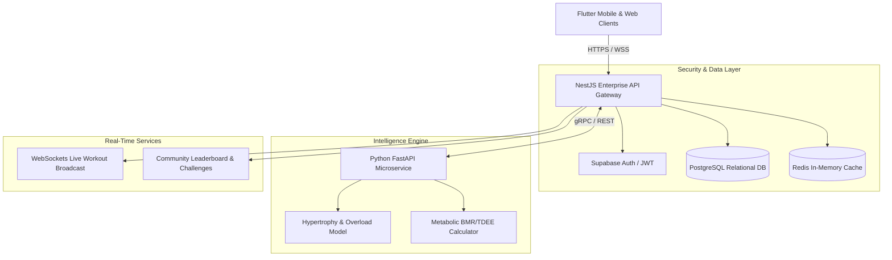

# ⚡ FitFlow Redesign — Next-Gen AI Fitness Platform & Architecture

[](./docs/activity04-high-level-archictecture.md)
[](./frontend/)
[](./backend/)
[](./ai-service/)
[](./backend/src/database/schema.prisma)

**FitFlow Redesign** is a high-performance fitness intelligence ecosystem designed to optimize athletic performance, streamline nutrition and macro tracking, and deliver real-time AI-powered training guidance across Android, iOS, and Web.

---

## 🏛️ System Architecture Overview



---

## 📂 Repository Structure

```
Fitflow-Redesign/
├── docs/                                  # Comprehensive System Architecture & Activities
│   ├── activity01-technology-comparison.md # Frontend evaluation & benchmarks
│   ├── activity02-backend-database-auth.md # Backend, DB, and Auth architecture
│   ├── activity03-technology-comparison-matrix.md # Weighted decision matrices
│   ├── activity04-high-level-archictecture.md # High-level diagrams & data flows
│   ├── ADR-001-architecture-decisions.md  # Formal Architecture Decision Records
│   └── README.md                          # Documentation index
│
├── frontend/                              # Cross-Platform Flutter Application
│   ├── lib/                               # Application source code
│   ├── pubspec.yaml                       # Flutter dependencies
│   └── README.md                          # Frontend setup guide
│
├── backend/                               # NestJS Enterprise API Gateway
│   ├── src/                               # Modules (Auth, Workouts, Nutrition, AI, Social)
│   ├── package.json                       # Node dependencies
│   ├── tsconfig.json                      # TypeScript config
│   └── README.md                          # Backend instructions
│
├── ai-service/                            # Python FastAPI AI Microservice
│   ├── main.py                            # FastAPI application server
│   ├── recommender.py                     # Workout generation logic
│   ├── analytics.py                       # Nutrition & BMR/TDEE analytics
│   ├── models.py                          # Pydantic data schemas
│   ├── requirements.txt                   # Python dependencies
│   └── README.md                          # AI service instructions
│
├── index.html                             # 🚀 Live Interactive FitFlow Web Application
├── styles.css                             # Cyber-Athletic Glassmorphism Design System
├── app.js                                 # Full Interactive Web Client Engine
└── README.md                              # Main Project Overview
```

---

## 🌟 Key Features & Innovations

1. **⚡ Live Active Workout Mode & Voice Trainer**:
   - Real-time countdown and interval timer.
   - Interactive speech synthesis voice coaching cues (`Web Speech API`).
   - Set-by-set telemetry logger with rest chime and target heart rate zones.
   - Muscle activation breakdown.

2. **🥗 Smart Nutrition & Macro Tracker**:
   - Dynamic Mifflin-St Jeor metabolic calculator.
   - Real-time Protein / Carbs / Fats ring progress visualizers.
   - Fast meal logger (Breakfast, Lunch, Dinner, Snacks) with instant calorie updates.
   - Hydration tracker with quick-tap water loggers.

3. **🤖 Personalized AI Fitness Microservice**:
   - Dynamic workout generator based on goals, experience level, time, and equipment.
   - Periodization engine with progressive overload calculations.
   - Readiness & fatigue score evaluator.

4. **📊 Biometric Progress Analytics**:
   - Interactive Canvas trend charts (Body Weight, 1RM progression, Volume load).
   - Streak counters, workout history, and unlockable achievement trophies.

5. **🏆 Live Community & Leaderboard**:
   - Real-time community activity feed.
   - Interactive cheers/kudos reaction system.
   - Weekly leaderboard rankings and milestone badges.

6. **🏛️ Interactive Architecture & Matrix Explorer**:
   - Interactive diagram explorer with node inspection.
   - Live interactive Technology Comparison Matrix with dynamic weighting sliders.
   - Live API endpoint simulator and ADR browser.

---

## 🚀 Running the Live Interactive Web Application

Open `index.html` in your browser, or start a local web server:

```bash
# Using Python
python -m http.server 3000

# Or using Node / npx
npx serve .
```
Navigate to `http://localhost:3000` to interact with the full application!
