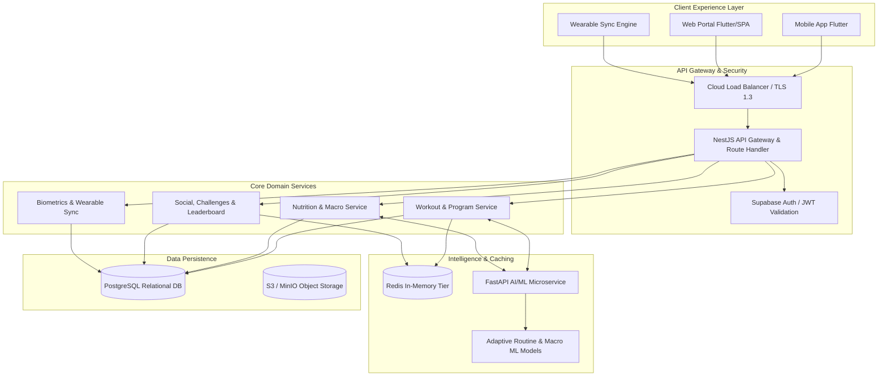

# Activity 4 – High-Level System Architecture & Flow Specifications

## 1. System Overview
**FitFlow Redesign** employs an event-driven, micro-modular architecture engineered for high fault tolerance, horizontal elasticity, and low-latency interaction.



---

## 2. Critical Data Flows

### 2.1 Personalized Workout Generation Flow
1. **User Request**: User configures goals (e.g. Hypertrophy, 4-day split, Dumbbells only, 45 min duration).
2. **Gateway Reception**: NestJS validates JWT token, verifies rate-limits, and checks Redis cache for cached routine archetype.
3. **AI Dispatch**: If no cache hit, NestJS dispatches a gRPC/REST payload to `FastAPI AI Microservice (/recommend/workout)`.
4. **Machine Learning Inference**: Python AI engine evaluates athlete profile, target muscle recovery scores, progressive overload thresholds, and generates an optimized periodized routine.
5. **Storage & Cache**: NestJS persists generated routine into PostgreSQL under user foreign key and stores serialized plan in Redis with a 72-hour TTL.
6. **Delivery**: Flutter client receives JSON payload, caches locally in SQLite/Hive for offline execution, and triggers voice coach cues.

---

### 2.2 Live Active Workout & Sensor Stream Flow
```
Athlete Device (Flutter)
   │ (1) Start Workout Event
   ▼
NestJS WebSocket Gateway ──► Redis Pub/Sub (Live Active Sessions)
   │ (2) Real-time Set/Rep Logging & Heart Rate stream
   ▼
PostgreSQL (Batch written at set completion)
   │ (3) Workout Completed Event
   ▼
FastAPI AI Service ──► Computes Volume Load, 1RM updates, Fatigue Index
   │ (4) Updated Stats & Badges
   ▼
Flutter Client Dashboard (Instant UI feedback & Milestone Unlocks)
```

---

### 2.3 Smart Nutrition & Calorie Tracking Flow
1. **Meal Logging**: User logs ingredients or selects meals from pre-calculated database.
2. **Macro Aggregation**: NestJS calculates instantaneous calorie, protein, carbohydrate, and fat deficits/surpluses against dynamic BMR/TDEE calculations.
3. **AI Auto-Adjustment**: If caloric burn from completed workout exceeds projected values by >15%, the AI service suggests dynamic intra-day re-feed macro adjustments.
4. **Real-time Feedback**: Client renders progress circular rings with animated micro-transitions.

---

## 3. Resilience, Scalability & Fault Tolerance
- **Independent Scaling**: The compute-heavy Python AI microservice scales horizontally on Kubernetes pods independently from the I/O-bound NestJS backend.
- **Circuit Breakers**: If the AI microservice is temporarily unreachable, NestJS seamlessly falls back to pre-computed deterministic algorithmic workout templates.
- **Offline-First Resilience**: All active workout data is buffered in local client storage and synchronizes automatically upon network reconnection.
